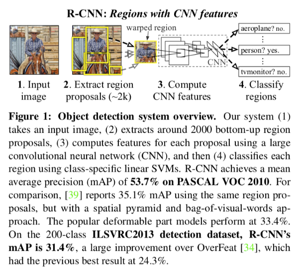
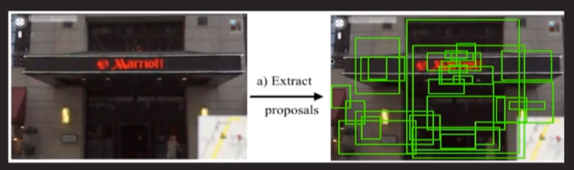
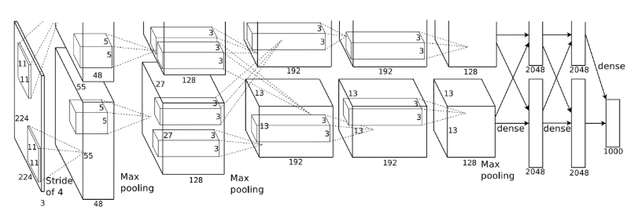

Object Detection 분야에 최초로 Deep Learning을 적용시킨 [R-CNN](https://arxiv.org/pdf/1311.2524.pdf) 논문 리뷰 내용.

  

### 요약
---
VOC2012(Visual Object Classes Challenge) mAP(mean average precision)에 있어서 30% 향상(mAP 53.3%) 시켰다.
OverFeat 이라는 CNN에 기반한 `sliding-window detector` 아키텍쳐와 비교해도, 200-class ILSVRC 2013 detection dataset에서 성능에 있어서 큰 차이가 있었다.
논문에서는 두 가지 인사이트를 조합하여 성능 향상을 하였다.
1. CNN is a powerful classifier  
2. Supervised pre-training for detection

  

### R-CNN 구조
---
1. 이미지를 input으로 넣는다.  
2. 2000개의 영역(Bounding Box)를 Selective Search 알고리즘을 통해 추출하여 잘라낸다.(Cropping)  
3. CNN모델에 넣기 위해 같은 사이즈(227 x 227 pixel size)로 찌그러뜨린다(Warping)  
4. 2000개의 Warped image를 각각 CNN 모델에 넣는다.  
5. 각각 Classification을 진행하여 결과를 도출  

  

### R-CNN의 세가지 모듈
---
  

+ Grenerating category independent `region proposals` 
    - 카테고리와 무관하게 물체의 영역을 찾는 모듈 

+ Extracts a fixed length feature vector from `CNN` 
    - 각각의 영역으로부터 고정된 크기의 `Feature Vector` 를 뽑아내는 `Large Convolutional Network`
  
+ Class specific linear `SVMs` 
    - Classification 을 위한 선형 지도 학습 모델 `Support Vector Machine(SVM)`

  

### Region Proposals
--- 
  
+ `R-CNN`은 `Region Proposal` 단계에서 `Selective Search` 알고리즘을 사용한다. 
+ `Selective Search` 알고리즘은 `Segmentation` 분야에서 많이 쓰이는 알고리즘이다.
    - Selective Search` 알고리즘은 객체와 주변간의 색감(Color), 질감(Texture)차이, 다른 물체에 애워쌓여있는지(Enclosed) 여부 등을 파악해서 다양한 전략으로 물체의 위치를 파악하는 알고리즘이다. 
+ `R-CNN`에서는 `Selective Search` 알고리즘을 통해 한 이미지에서 2000개의 Region을 뽑아내고, 모두 CNN에 넣기 위해 227 x 227 로 `resize` 하는 작업을 거친다.

  

### CNN(based AlexNet)
--- 
  

+ CNN은 `AlexNet`의 구조을 base로 사용하였다.
+ AlexNet Network 마지막 부분을 Detection을 위한 Class 수 만큼 바꾼다.
+ Object Detection용 Dataset을 넣어 `Fine-Tuning`을 진행한다. 
+ 각각의 region proposal로부터 4096-dimentional feature vector를 뽑아내고, `Fixed-length Feature Vector`를 만들어 내는 과정을 거친다.

  

### Bounding box regression
---
   

+ Selective Search로 만들어낸 Bounding Box는 정확하지 않기 때문에 물체를 정확히 감싸도록 조정하는 `선형회귀 모델(Bounding Box Regression)`을 사용한다.

  

  

### R-CNN의 Speed bottleneck 
---
1. 모든 입력 이미지 N에 대해서 region proposals 2000개 생성한다.
2. 2000개의 region proposals 각각에 대해 CNN feature vector추출(N imags*2000)한다.
3. 다음 3가지 과정에 대해 분리 되어 동작한다.  
    (1) CNN을 통한 feature vector 추출  
    (2) SVM classifier를 통한 image classification  
    (3) Bounding box regression  
   
  
 
### Result
---

> + 오래걸린다.
>    - Selective Search 2000개의 영역에 대해서 모두 CNN 모델에 넣는다.
>    - Training Time(84시간), Testing Time(GPU K40기준, frame당 14초)
> + 복잡하다.
>    - CNN, SVM, Bounding Box Regression 세 가지 모델을 필요한 구조이다.
> + Back Propagation이 안된다.
>     - SVM, Bounding Box Regression에서 학습한 결과가 CNN을 업데이트 못한다.
> + R-CNN은 최초로 Object Detection에 Deep Learning 방법인 CNN을 적용하여, `2-stage detector`들의 구조에 막대한 영향을 미쳤다.